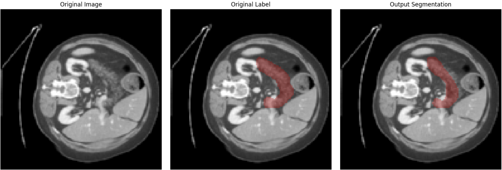
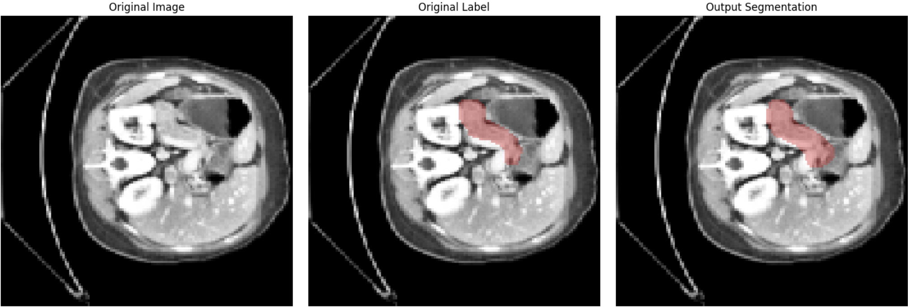

<h1 align="center">
  3D Encoder-Decoder Architecture with Residual Units for Automatic Pancreas Segmentation
</h1>

 
  Authors: Richard Ji, All contributions are welcome!

 
 

     

# Overview

This model, a unique and innovative 3D U-Net structure, is specifically designed for automatic pancreatic segmentation tasks. It stands out due to its enhancement with residual units and an encoder-decoder architecture. This design allows the model to efficiently extract and process volumetric features at multiple scales, making it versatile for various segmentation tasks. The network configuration includes 1 input channel and 2 output channels. It comprises 5 levels of convolutional layers with an increasing number of channels (16, 32, 64, 128, 256), each followed by a stride of 2 for down-sampling. This structure enables the model to capture complex patterns in the data.

One of the unique aspects of this model is the integration of residual units within its structure. These units help in alleviating the vanishing gradient problem, enabling the model to learn more complex patterns. To stabilize the learning process and introduce non-linearity, the model employs batch normalization and ReLU activation function. A dropout layer is also included for regularization to prevent overfitting. Designed to run on a CUDA-enabled GPU, our model harnesses the power of parallel processing for high-performance computation. This makes it a powerful tool for tackling complex pancreatic segmentation tasks.

# Motivation

The motivation behind creating an automatic pancreas segmentation model stems from the critical need to improve the diagnosis and treatment of pancreatic cancer. Pancreatic cancer is one of the deadliest forms of cancer, with a five-year survival rate of only 12%. In 2020, there were more than 495,000 new cases of pancreatic cancer worldwide.

Despite advancements in medical technology, the death rate from pancreatic cancer has not significantly decreased over the past 40 years. This is largely due to the difficulty in detecting the disease in its early stages when it’s most treatable. An automatic pancreas segmentation model can aid in early detection by accurately identifying and segmenting the pancreas in medical imaging scans. This not only saves valuable time for healthcare professionals but also increases the chances of early intervention, potentially saving lives.

Moreover, such a model can also assist in planning for surgeries and treatments by providing precise measurements and locations of tumors within the pancreas. By harnessing the power of artificial intelligence, we can make strides in combating this deadly disease.

# Method

This dataset utilises the [Medical Segmentation Decathlon Pancreas dataset](http://medicaldecathlon.com/) which includes over 420 3D volumes (Although some were lost when I downloaded them. Please tell me why it happened if you have similar experience). Performing segmentation was especially difficult on this dataset due to it also containing small tumour structures which often confused the model. Soon, I will try it with the TCIA's Pancreas Dataset.

## Preprocessing

A series of transformations are applied to the dataset more consistent results and higher performing models. These include:
- Adjusting the intensity of the image, Normalizing the image
- Enhancing the image using Adaptive Histogram Equalization
- Adding an extra dimension to the data to represent channels
- Resampling the images to a specified pixel spacing
- Reorientating the images to a specified anatomical orientation 
- Scaling the intensity of the images to a specified range
- Cropping any unnecessary background from the images
- Resizing the images to a specified spatial size
- Converting the images to PyTorch tensors

## Results

## GUI

## Note

The nifti2dicom folder was originally from amine0110. 
- Check out the repo here: https://github.com/amine0110/nifti2dicom. 
- Also check him out on github: https://github.com/amine0110