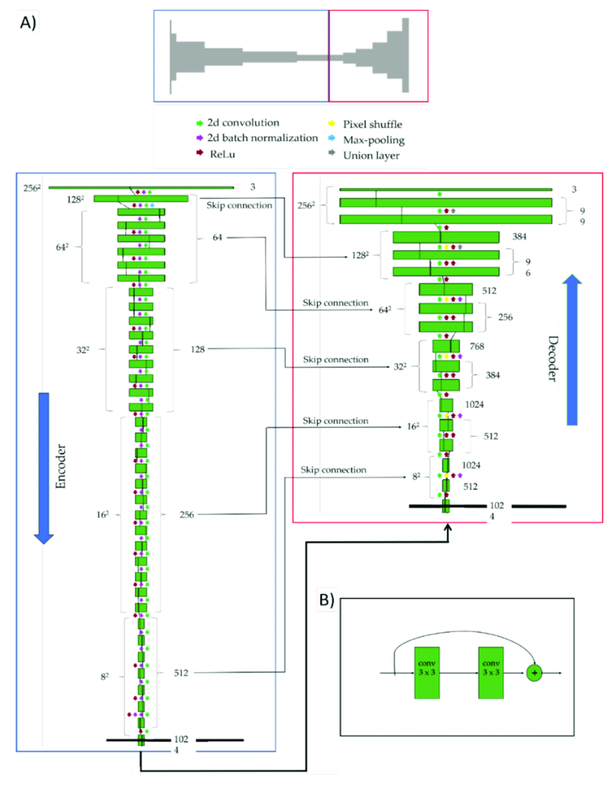
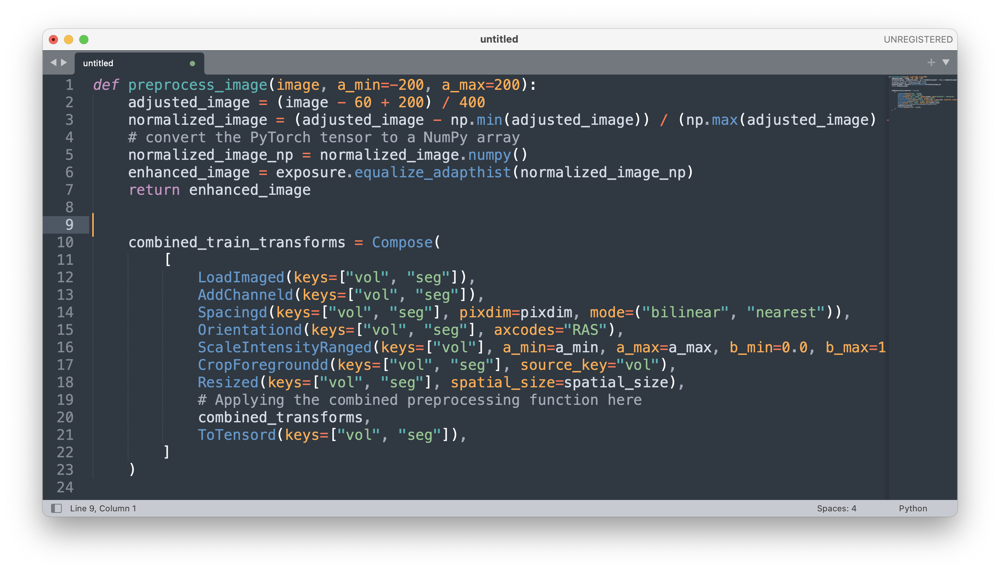

<h1 align="center">
  3D Encoder-Decoder Architecture for Automatic Pancreatic Semantic Segmentation
</h1>

<div align="center"> 
  Authors: Richard Ji

<br/>
<br/>

  [](https://github.com/richardji1/PankVision-3D/issues) [](https://github.com/richardji1/PankVision-3D/stargazers) [](https://github.com/richardji1/PankVision-3D)  

</div>

# Overview

PankVision currently uses a Dynamic 3D U-Net architecture. It's unique due to its integration of residual units and an encoder-decoder structure, allowing efficient extraction and processing of volumetric features at multiple scales. The Dynamic U-Net configuration includes 1 input channel, 2 output channels, and 5 levels of convolutional layers with an increasing number of channels (16, 32, 64, 128, 256), each followed by a stride of 2 for down-sampling. The model employs batch normalization and ReLU activation function for stabilizing the learning process and introducing non-linearity. A dropout layer is included for regularization to prevent overfitting. Designed to run on a CUDA-enabled GPU, the model leverages parallel processing for high-performance computation, making it a powerful tool for complex pancreatic segmentation tasks.

## Motivation

The creation of an automatic pancreas segmentation model is driven by the urgent need to enhance the diagnosis and treatment of pancreatic cancer, a deadly disease with a five-year survival rate of only 12%. Despite medical advancements, the mortality rate hasn't significantly decreased over the past four decades due to challenges in early detection. An automatic pancreas segmentation model can aid in early detection by accurately identifying and segmenting the pancreas in medical imaging scans, saving valuable time for healthcare professionals and increasing the chances of early intervention. Additionally, it can assist in surgical planning and treatments by providing precise measurements and locations of tumors within the pancreas. Harnessing artificial intelligence in this way can contribute to combating this lethal disease.

# Model Architecture

An Overview of Dynamic Unet is depicted in this picture:



## Preprocessing

A series of transformations are applied to the dataset more consistent results and higher performing models. This is a segment of preprocessing code.


Features Summarised:
- [x] Adjusting the intensity of the image, Normalizing the image
- [x] Enhancing the image using Adaptive Histogram Equalization
- [x] Adding an extra dimension to the data to represent channels
- [x] Resampling the images to a specified pixel spacing
- [x] Reorientating the images to a specified anatomical orientation 
- [x] Scaling the intensity of the images to a specified range
- [x] Cropping any unnecessary background from the images
- [x] Resizing the images to a specified spatial size
- [x] Converting the images to PyTorch tensors

# Results

Recent Results of Dynamic Unet

| . | . | 
|-----------------|-----------------|
|    |    | 
|    |    | 
|    |    | 

## Usage and Installation

1. Create virtual environment `conda create -n pankvision3d python=3.10 -y` and activate `conda activate pankvision3d`
2. (Optional: If learning through python) Install [Pytorch 2.0](https://pytorch.org/get-started/locally/)
3. `git clone https://github.com/RJi26/PankVision-3D`
4. Enter PankVision folder via `cd PankVision-3D` and run `pip install -e .`

## UI

PyQt5 based tool for pancreatic segmentation visualization. The UI can be started through running the following commands. Remember to install `PyQT5` with [pip](https://pypi.org/project/PyQt5/): `pip install PyQt5` or [conda](https://anaconda.org/anaconda/pyqt): `conda instsall -c anaconda pyqt5`

```
cd gui
python gui.py
```


## Contributions

Any contributions are greatly appreciated! If you want to contribute to this project, you can use the below commands to get started.

1. Fork the Project
2. Create your Feature Branch `(git checkout -b feature/Feature)`
3. Commit your Changes `(git commit -m 'Added Feature')`
4. Push to the Branch `(git push origin feature/Feature)`
5. Open a Pull Request

## Final Note

The nifti2dicom folder was originally from @amine0110. 
- Check out the repository [here](https://github.com/amine0110/nifti2dicom)

This dataset utilises the [Medical Segmentation Decathlon Pancreas dataset](http://medicaldecathlon.com/) which includes over 420 3D volumes (Although some were lost when I downloaded them. Please tell me why it happened if you have similar experience). Performing segmentation was especially difficult on this dataset due to it also containing small tumour structures which often confused the model. Soon, I will try it with the TCIA's Pancreas Dataset.